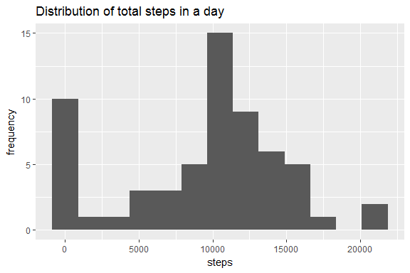
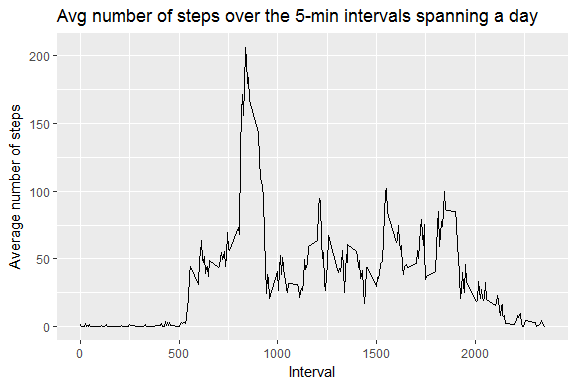
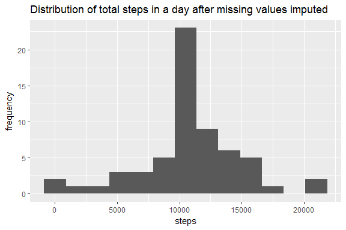
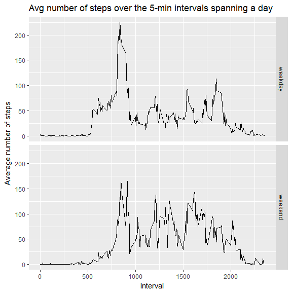

# Reproducible Research: Peer Assessment 1


## Loading and preprocessing the data

HOUSEKEEPING: FILE LOCATIONS, PACKAGES ETC

```r
coursera <- "C:/Users/sahutj/Box Sync/Resources/R/Coursera"
course<-"5.ReproducibleResearch"
folder<-"RepData_PeerAssessment1"
f<-file.path(coursera,course,folder)
setwd(f)

if (!("activity.csv" %in% dir())) {
  unzip("activity.zip")
  downloadDate<-Sys.Date()
  }

if (!exists("RAW")) {
  RAW <- read.csv("activity.csv")
}

library(dplyr);library(ggplot2)
```

```
## 
## Attaching package: 'dplyr'
```

```
## The following objects are masked from 'package:stats':
## 
##     filter, lag
```

```
## The following objects are masked from 'package:base':
## 
##     intersect, setdiff, setequal, union
```

```r
options(scipen=999)#preventing scientific notation in output.  
```


## What is mean total number of steps taken per day?
The following code produces a histogram, mean, and median of total steps

```r
PerDay<-RAW %>% 
    group_by(date) %>% 
    summarize(TotalSteps=sum(steps,na.rm=TRUE))

TheMean<-round(mean(PerDay$TotalSteps),1)
TheMedian<-round(median(PerDay$TotalSteps),1)

ggplot(PerDay,aes(TotalSteps))+
    geom_histogram(binwidth = 1750)+ 
    labs(  x = "steps"
          ,y = "frequency"
          ,title ="Distribution of total steps in a day")
```

<!-- -->

```r
print(TheMean)
```

```
## [1] 9354.2
```

```r
print(TheMedian)
```

```
## [1] 10395
```
  
  The mean total steps was 9354.2, and the median was 10395.

## What is the average daily activity pattern?
The following code produces a line plot of the 5-minute interval (x-axis) and the average number of steps taken, averaged across all days (y-axis).  After the plot, the interval with the max avg steps is reported.

```r
PerInterval<-RAW %>% 
    group_by(interval) %>% 
    summarize(AvgSteps=mean(steps,na.rm=TRUE))

MaxsIndex<-which.max(PerInterval$AvgSteps)
IntervalwMax<-PerInterval$interval[MaxsIndex]

g<-ggplot(PerInterval,aes(interval,AvgSteps))
g + geom_line()+ 
    labs(  x = "Interval"
          ,y = "Average number of steps"
          ,title ="Avg number of steps over the 5-min intervals spanning a day")
```

<!-- -->

```r
print(IntervalwMax)
```

```
## [1] 835
```
  
  The average number of steps was at its max in Interval=835

## Imputing missing values

There are 2304 missing values for the Number of Steps variable.  The following code estimates the number of steps with a loess curve (based on interval).  The loess curve is used to impute values where they were missing.  The resulting distribution's histogram, mean, and median are reported.

```r
# loess curve estimates avg steps for each interval.  
loessMod10 <- loess(AvgSteps ~ interval, data=PerInterval, span=0.10) 

#all the predictions based on interval
AllPredictedValues<-predict(loessMod10,RAW$interval) 

#if actual value exists, use it.  otherwise use predicted.  
RAWwImp<-RAW %>% 
        mutate(steps=coalesce(as.numeric(RAW$steps),AllPredictedValues) )

# totals per day w/imputation
PerDaywImp<-group_by(RAWwImp,date) %>% 
        summarize(TotalSteps=sum(steps,na.rm=TRUE))

TheNewMean<-round(mean(PerDaywImp$TotalSteps),2)
TheNewMedian<-round(median(PerDaywImp$TotalSteps),2)

#new histogram
ggplot(PerDaywImp,aes(TotalSteps))+
    geom_histogram(binwidth = 1750)+ 
    labs(  x = "steps"
          ,y = "frequency"
          ,title ="Distribution of total steps in a day after missing values imputed")
```

<!-- -->

```r
print(TheNewMean)
```

```
## [1] 10765.49
```

```r
print(TheNewMedian)
```

```
## [1] 10760.86
```
  
  After imputing the missing values, the new mean total steps was 10765.49, and the median was 10760.86 -- These new values are slightly larger than when we ignored missing values.  


## Are there differences in activity patterns between weekdays and weekends?
  
  The following code plots the 5-minute interval (x-axis) and the average number of steps taken, averaged across all weekday days or weekend days (y-axis)


```r
# totals per day w/imputation
RAWwImp2<-RAWwImp %>% 
        mutate(dayofweek=weekdays(as.Date(date))
               ,daytype=factor(ifelse(dayofweek %in% c("Saturday","Sunday"),"weekend","weekday"))
               ) %>% 
    group_by(daytype,interval) %>% 
    summarize(AvgSteps=mean(steps,na.rm=TRUE))

#panel line plot
ggplot(RAWwImp2,aes(interval,AvgSteps))+
    geom_line()+
    facet_grid(daytype ~ .)+ 
    labs(  x = "Interval"
          ,y = "Average number of steps"
          ,title ="Avg number of steps over the 5-min intervals spanning a day")
```

<!-- -->


